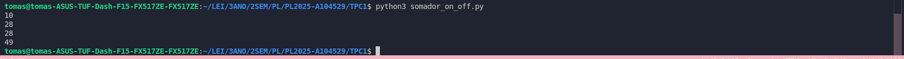

<!-- 

O manifesto deverá ter a seguinte estrutura: título, data, autor (nome, número e foto), resumo (lista de parágrafos descrevendo sucintamente em que consistiu o trabalho), lista de resultados (lista com apontadores para os ficheiros resultantes);

-->

# Processamento de Linguagens (TPC1) - Somador ON/OFF
- **Data:** 10 de fevereiro de 2025
- **Autor:** Tomás Henrique Alves Melo - A104529 

## Objetivo 

**Criar um programa em Python que soma todas as sequências de digitos que encontre num texto.**
1. **Sempre que encontrar a string "Off" em qualquer combinação de maiúsculas e minúsculas, esse comportamento é desligado.**
2. **Sempre que encontrar a string "On" em qualquer combinação de maiúsculas e minúsculas, esse comportamento é ligado.**
3. **Sempre que encontrar o caracter "=", o resultado da soma é colocado na saída.**

## Exemplo: 

###### Dado a seguinte mensagem de entrada: 
"1a2b3c4d=on5e6f7g=off8h9i=on10j11k"

###### O output deverá ser: 

-> 10  
-> 28  
-> 28

## Resumo

No código desenvolvido para responder ao exercício indicado, após rever conceitos de linguagem Python, apliquei-os, de modo a conseguir desenvolver uma versão simples e funcional que consiste na iteração de toda a mensagem caracter a caracter, com recurso a uma variável de controlo de estado do somador, váriavel 'ligado', que indica se o somador está ligado ou não (inicialmente esta variável encontra-se como 'True'), acumulação dos números numa variável temporária (filtragem dos números feita pelo método isdigit()) que irá permitir a soma dos números obtidos até ao momento e posterior reset, de modo a poder acumular novos números sempre que a soma dos já acumulados é feita, procura pelas strings 'on' e 'off' para verificar as mudanças de estado do somador (uma vez que estas strings podem aparecer na mensagem de entrada em qualquer combinação de maiúsculas e minúsculas, a comparação é feita no estado em que todos os caracteres se encontram em minúsculo ao recorrer ao método .lower()) e procura pelo caracetere '=' para, assim, retornar a soma acumulada na variável 'soma' até ao momento. 

Todo o código encontra-se adequadamente documentado para fácil entendimento daquilo que foi feito neste trabalho prático. 

Foram realizados vários testes com diversas strings de entrada, de modo a testar corretamente a fidelidade do código desenvolvido tendo em conta o output esperado para cada tipo de mensagem de entrada escolhida.

## Ficheiro & Resultado 

#### [somador_on_off.py](./somador_on_off.py)
### Output:

