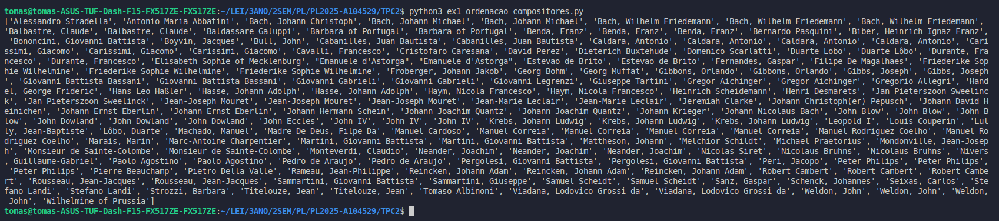
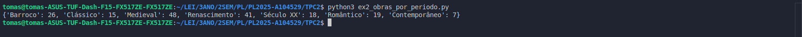
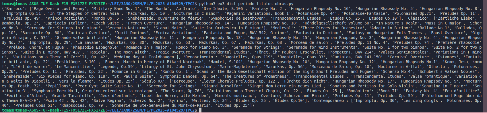

<!-- 

O manifesto deverá ter a seguinte estrutura: título, data, autor (nome, número e foto), resumo (lista de parágrafos descrevendo sucintamente em que consistiu o trabalho), lista de resultados (lista com apontadores para os ficheiros resultantes);

-->

# Processamento de Linguagens (TPC2) - Análise de um dataset de obras musicais
- **Data:** 14 de fevereiro de 2025
- **Autor:** Tomás Henrique Alves Melo - A104529 

## Objetivo 

**Neste TPC, é proibido usar o módulo CSV do Python**
**Deverás ler o dataset, processá-lo e criar os seguintes resultados:**
1. **Lista ordenada alfabeticamente dos compositores musicais;**
2. **Distribuição das obras por período: quantas obras catalogadas em cada período;**
3. **Dicionário em que a cada período está a associada uma lista alfabética dos títulos das obras desse período.**

## Resumo

Para realizar este trabalho decidi dividir em 2 principais componentes. A primeira componente consiste no processo de parsing do ficheiro obras.csv fornecido. A segunda componente foca-se na resolução dos exercícios 1, 2 e 3 fornecidos, que, se tornam de fácil resolução após certeza do sucesso do processo de parsing.

A função parse_csv lê um ficheiro CSV manualmente, sem usar o módulo csv do Python (proibido pelas indicações do enunciado). Primeiro, abre o ficheiro e armazena o seu conteúdo como uma string. Em seguida, percorre essa string caractere por caractere para identificar campos e linhas, respeitando aspas (") e delimitadores (;). Se encontra um ; fora das aspas, separa os campos; se encontra uma quebra de linha (\n ou \r), finaliza a linha e adiciona-a à lista de dados. Aspas duplas ("") dentro de campos são tratadas corretamente. No final, remove a primeira linha (cabeçalho) antes de retornar os dados processados como uma lista de listas. A saída do processo de parsing consiste, por fim, numa lista que contém em cada um dos seus índices uma linha do ficheiro .csv (excluindo o cabeçalho). 
Após a certeza de que o parsing foi executado com sucesso a partir de múltiplos testes e análise cuidada, a resolução dos exercícios propostos, com base na lista fornecida pela função de parsing tornou-se simples ao percorrer a lista resultante executando para cada função a lógica necessária pedida. 

Para o exercício 1, a lista resultante foi percorrida e, para cada entrada armazenamos o valor de 'compositor', armazenamos numa nova lista todos os compositores. Por fim, sabendo que todos os compositores iniciam-se por caracter maiúsculo bastou usar o método sort(), nativo do Python, pertencente à classe list, para ordenar a lista por ordem alfabética, retornando, assim, a lista ordenada, no final da função.

Para o exercício 2, a lista resultante foi percorrida e, para cada entrada armazenamos o valor do 'período'. Previamente criámos um dicionário que funciona como contador dos dados necessários. O dicionário encontra-se mapeado de período para número de obras catalogadas naquele período. Desta forma, se o período ainda não se encontrar no dicionário, adicionamos o período ao mapa, juntamente com o valor 1. Caso contrário, incrementamos o valor associado àquele período. Por fim, teremos um dicionário a indicar, para cada período, a quantidade de obras naquele período.

Por fim, para o exercício 3, a lista resultante foi percorrida e, para cada entrada armazenamos os valores de 'período' e 'título'. Previamente, assim como no último exercício, criámos um dicionário, porém este terá como valor uma lista. O dicionário encontra-se mapeado de período para lista (de títulos). Se o período não existir criámos uma nova lista associada associada àquele período. Caso contrário, adicionámos o título à lista associada àquele período. Por fim, teremos um dicionário a indicar, para cada período, a lista de títulos das obras desse período.

## Ficheiros & Resultados 

#### Ficheiros desenvolvidos

#### [parse_csv.py](./parse_csv.py)

#### [ex1_ordenacao_compositores.py](./ex1_ordenacao_compositores.py)
#### Saída:

#### [ex2_obras_periodo.py](./ex2_obras_periodo.py)
#### Saída:

#### [ex3_dict_periodo_titulos_obras.py](./ex3_dict_periodo_titulos_obras.py)
#### Saída:

