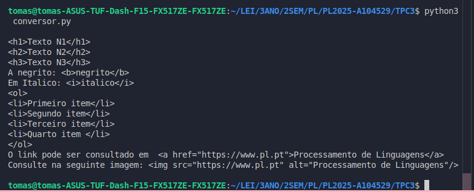

<!-- 

O manifesto deverá ter a seguinte estrutura: título, data, autor (nome, número e foto), resumo (lista de parágrafos descrevendo sucintamente em que consistiu o trabalho), lista de resultados (lista com apontadores para os ficheiros resultantes);

-->


# Processamento de Linguagens (TPC3) - Conversor de MarkDown para HTML 
- **Data:** 22 de fevereiro de 2025
- **Autor:** Tomás Henrique Alves Melo - A104529 


## Objetivo 

**Criar em Python um pequeno conversor de MarkDown para HTML para os elementos descritos na "Basic Syntax" da Cheat Sheet:**

Cabeçalhos: linhas iniciadas por "# texto", ou "## texto" ou "### texto"
 
###### In 
```text
# Exemplo 
```
###### Out 
```text
<h1>Exemplo</h1>
```
Bold: pedaços de texto entre "**"

###### In 
```text
Este é um **exemplo** ...
```
###### Out 
```text
Este é um <b>exemplo</b> ...
```

Itálico: pedaços de texto entre "*":
###### In 
```text
In: Este é um *exemplo* ...
```
###### Out 
```text
Out: Este é um <i>exemplo</i> ...
```

Lista numerada:

###### In:

```text
1. Primeiro item
2. Segundo item
3. Terceiro item

```


###### Out: 

```text
<ol>
<li>Primeiro item</li>
<li>Segundo item</li>
<li>Terceiro item</li>
</ol>
```

Link: [texto](endereço URL)

###### In: Como pode ser consultado em \[página da UC](http://www.uc.pt)


###### Out: Como pode ser consultado em \<a href="http://www.uc.pt">página da UC</a>


Imagem: 

###### In: Como se vê na imagem seguinte:  ...

###### Out: Como se vê na imagem seguinte:  ...


## Resumo & Reflexão Pessoal

Este código representa um conversor de Markdown para HTML que desenvolvi depois de entender bem como funcionam expressões regulares em Python. A ideia foi transformar elementos comuns do Markdown, como cabeçalhos, negrito, itálico, links, imagens e listas ordenadas, para as suas versões em HTML de forma automática e precisa.

O primeiro passo foi partir o texto em linhas com recurso a .splitlines(), para poder processá-lo linha por linha. Para garantir total controlo do fluxo, optei por usar um while com controlo manual do índice (i), permitindo-me avançar várias linhas de uma só vez, o que foi essencial para lidar com listas ordenadas que podem ter vários itens seguidos!

Cada linha é analisada para identificar padrões do Markdown ao usar regex (regular expressions). Se encontrar um cabeçalho (como #, ##, ### e assim por diante até ######), ele converte para o respectivo nível de \<h1> a \<h6> no HTML. A quantidade de # no início da linha define o nível do cabeçalho, e o texto logo a seguir é o conteúdo desse cabeçalho. Para isso, criei a função substituir_cabecalho() que faz essa transformação.

Para o negrito, usei o padrão \*\*texto\*\* e converti para \<b>texto\</b>, enquanto para o itálico utilizei o padrão \*texto\*, transformando em \<i>texto\</i>. A implementação para o negrito e itálico acabaram por ser mesmo muito semelhantes, porém decidi deixar as suas implementações separadas para o código ficar mais legível e limpo.

A parte mais trabalhosa foi lidar com links e imagens, porque precisei de garantir que o texto âncora ou o texto alternativo fossem convertidos corretamente. Para links, segui o padrão \[texto](url) e transformei em \<a href="url">texto</a>, mantendo a estrutura intuitiva do Markdown. Já para as imagens, que seguem o padrão \!\[alt](url), converti para \. Para garantir que todos os casos fossem tratados, inclusive URLs complexas, precisei de expressões regulares mais robustas.

O maior desafio, para mim, foi implementar a parte das listas ordenadas. Era preciso garantir que elas fossem agrupadas corretamente em \<ol> e \<li> e, para isso, precisei de abrir o \<ol> apenas uma vez quando encontrava o primeiro item da lista e fechar apenas quando o grupo de itens terminava. Consegui fazer isso com um while interno que mantém o \<ol> aberto até o último item, o que evita deixar o código confuso ao usar várias tags \<ol>\</ol> a abrir e fechar continuamente. 

Foquei-me também no aspeto da manutenção do códigom tornando-o flexível e "fácil de manter". Todos os padrões de expressões regulares foram colocados no início do código, o que facilita modificações futuras. Além disso, todas as substituições são feitas com re.sub() usando funções auxiliares como substituir_negrito() e link(), o que ajuda a manter o código organizado e evita repetições desnecessárias, para além de que optei criar uma função para cada tipo (negrito, link, imagem, etc). 

## Ficheiros & Resultados 

#### Ficheiro desenvolvido
#### [conversor.py](./conversor.py)
#### Saída:



