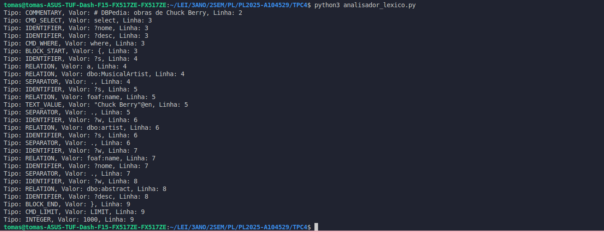

# Processamento de Linguagens (TPC4) - Analisador Léxico
- **Data:** 5 de março de 2025
- **Autor:** Tomás Henrique Alves Melo - A104529 


## Objetivo 

**Construir um analisador léxico para uma liguagem de query com a qual se podem escrever frases do género:**

###### DBPedia: obras de Chuck Berry
```text
select ?nome ?desc where {
?s a dbo:MusicalArtist.
?s foaf:name "Chuck Berry"@en .
?w dbo:artist ?s.
?w foaf:name ?nome.
?w dbo:abstract ?desc
} LIMIT 1000
 ```

## Resumo 

Este trabalho consistiu na criação de um analisador léxico (lexer) em Python, utilizando a biblioteca PLY (ply.lex), para processar consultas de uma linguagem de query simples. 

O objetivo foi identificar e classificar os tokens presentes nas queries, tais como palavras-chave (SELECT, WHERE, LIMIT), variáveis (?nome), relações (dbo:MusicalArtist), números (1000), strings ("Chuck Berry"@en), delimitadores ({}, .) e comentários (#).

Para isso, defini uma lista de tokens, onde cada elemento representa um tipo de padrão a ser identificado. Em seguida, associei cada token a uma função t_* que contém uma expressão regular para capturar o padrão correspondente. Por exemplo, variáveis são identificadas pela expressão r'\?\w+', enquanto strings utilizam r'"[^"]*"(?:@\w{2,})?'.

O código foi estruturado para que o analisador léxico ignore espaços em branco e tabulações (t_ignore = ' \t'), conte corretamente as quebras de linha (t_newline()) e trate possíveis erros léxicos (t_error()) de maneira robusta. O analisador recebe uma string que representa a query a executar e processa linha por linha, gerando assim uma lista formatada de tokens, exibindo o tipo do token, o seu valor e a linha onde foi encontrado. 

Um dos desafios enfrentados foi garantir que as listas ordenadas de tokens fossem processadas corretamente, evitando sobreposição de padrões que poderiam gerar resultados inesperados. Para isso, a ordem das regras de reconhecimento foi ajustada, garantindo que tokens específicos fossem priorizados antes de padrões mais genéricos.

O programa foi testado com diferentes consultas de exemplo, como:

```text
SELECT ?nome ?descricao WHERE {
    ?s a dbo:MusicalArtist.
    ?s foaf:name "Chuck Berry"@en .
    ?obra dbo:artist ?s.
    ?obra foaf:name ?nome.
    ?obra dbo:abstract ?descricao
} LIMIT 1000
```
O output é uma sequência bem definida de tokens, demonstrando que o lexer interpreta corretamente a estrutura da query. Realizei vários testes com diferentes strings de entrada, e os resultados produzidos foram analisados com cuidado para garantir que o programa estivesse a produzir o output esperado/correto.

O código final é modular, eficiente, podendo ser facilmente adaptado para suportar novos tokens. 

## Ficheiros & Resultados 

#### [analisador_lexico.py](./analisador_lexico.py)
#### Saída:
