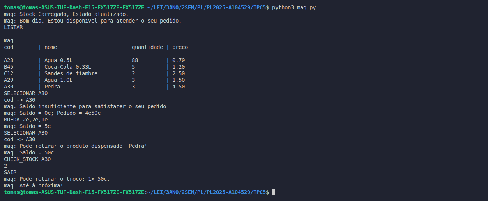
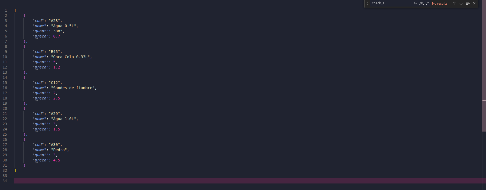

# Processamento de Linguagens (TPC5) - Máquina de Vending 
- **Data:** 11 de março de 2025
- **Autor:** Tomás Henrique Alves Melo - A104529 

## Objetivo

O objetivo deste trabalho prático semanal foi desenvolver uma máquina de vendas interativa em Python que permite aos utilizadores do programa listar produtos disponíveis, inserir dinheiro, receber troco, selecionar produtos. Foi ainda sugerido implementar funcionalidades extras que fossem fruto da nossa criatividade. Irei falar delas mais à frente.

## Resumo & Reflexão Pessoal

O programa implementa um sistema de máquina de vendas que gerencia o stock de produtos e controla transações de dinheiro entre o utilizador do programa e uma máquina de venda de produtos. Para desenvolver este programa, comecei por criar as funções de manipulação dos ficheiros de formato JSON (escrita e leitura). 

O programa é iniciado com a leitura do ficheiro stock.json para carregar os dados em memória tal como especificado no enunciado e, caso hajam atualizações a serem feitas no stock.json, estas são feitas à saída do programa, no caso da necessidade de atualização do stock de um produto ou para o caso da adição de novos produtos.

A função maq é a função principal do programa onde implementei a lógica para todas as possíveis mensagens de entrada que o programa oferece (LISTAR, MOEDA, SELECIONAR, SAIR, ADICIONAR, ATUALIZAR_STOCK, CHECK_STOCK). 

Tal como sugerido no enunciado, decidi acrescentar funcionalidades extras ao programa, tais como o suporte para adicionar novos produtos ao stock, verificar o stock geral da máquina indicando se esta está ou não vazia, verificar o stock individual de cada produto, atualizar o stock de um produto e adição de novos produtos.

Pessoalmente, o principal desafio deste trabalho foi na manipulação dos valores das moedas quer para avaliar se o saldo atual da máquina era suficiente para a compra de um dado produto, soma dos valores das moedas ou até mesmo no momento em que foi necessário implementar a devolução do troco, e não propriamente na criação de expressões regulares. 

Recorri também a expressões regulares para interpretar o input do utilizador para os diversos comandos, agrupando em grupos de captura para extrar a informação relevante de cada mensagem de input.
Tentei recorrer sempre que possível a expressões regulares, de modo a facilitar na implementação das funcionalidades que eram exigidas tendo recorrido ao findall() para extrair os valores das moedas inseridas pelo utilizador através do comando MOEDA, ao match() para verificar o formato dos diferentes tipos de input e ao fullmatch() para avaliar se um produto existe ou não no stock. 

Não recorri a grupos de captura nomeados, pois não achei necessário trazer essa "complexidade" extra ao programa, apesar de que poderia ter ajudado em alguns momentos para melhor entendimento do que estava a ser feito. 

### **Fluxo do Programa:**
1. Carrega o stock a partir do ficheiro JSON.
2. Exibe os produtos disponíveis.
3. Aguarda comandos por parte do utilizador do programa:
   - `LISTAR`: Lista os produtos disponíveis.
   - `MOEDA <valor>`: Processa as moedas inseridas.
   - `SELECIONAR <cod>`: Seleciona um produto caso haja saldo suficiente.
   - `SAIR`: Devolve o troco e termina. 
   - `ADICIONAR`: Permite adicionar novos produtos ao stock. 
   - `ATUALIZAR_STOCK <cod> <novo_stock>`: Permite atualizar o stock de um produto.
   - `CHECK_STOCK <cod>`: Permite visualizar o stock de um produto. 
4. Atualiza o stock no arquivo JSON no final da execução, com base nas interações feitas ao longo da execução do programa.

O programa foi testado enúmeras vezes e com diferentes entradas para validar a sua robustez e confiabilidade.

## Ficheiros & Resultados

#### Ficheiros desenvolvidos
#### [maq.py](./maq.py)
#### Saída:

#### [stock.json](./stock.json)
#### Saída:

