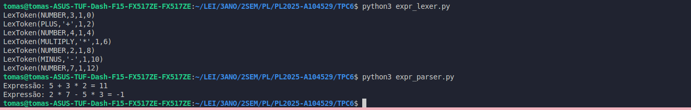
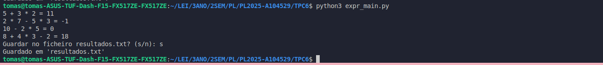

# Processamento de Linguagens (TPC6) - Interpretador para expressões aritméticas 
- **Data:** 20 de março de 2025
- **Autor:** Tomás Henrique Alves Melo - A104529 

## Objetivo

O trabalho semanal desta semana consistiu no desenvolvimento de um interpretador para expressões aritméticas em Python, com recurso à biblioteca PLY (Python Lex-Yacc) para a análise léxica. O sistema deve ser capaz de processar expressões matemáticas compostas por números e operadores básicos (+, -, *), garantindo que a ordem das operações seja aplicada corretamente. Como se sabe, a multiplicação tem prioridade sobre a adição e subtração em expressões matemáticas.

A implementação seguiu a abordagem de análise sintática recursiva descendente, permitindo interpretar expressões como 5 + 3 * 2 e 2 * 7 - 5 * 3 de maneira estruturada.

## Resumo & Reflexão Pessoal

Para desenvolver este TPC, comecei por criar o analisador léxico (expr_lexer.py). O objetivo principal deste programa era transformar uma expressão matemática em tokens, ou seja, identificar números e operadores (+, -, *). Para isso, utilizei a biblioteca PLY (Python Lex-Yacc), que me permitiu definir as regras para cada elemento das possíveis expressões.

Depois de concluir essa parte, passei para o desenvolvimento do analisador sintático (expr_parser.py). Este programa utiliza o lexer que criei anteriormente para processar os tokens e avaliar expressões matemáticas corretamente. Segui uma abordagem de parsing recursivo descendente, que respeita a precedência dos operadores (multiplicação antes de soma e subtração). Para tornar o código mais organizado, implementei o parser como uma classe Parser e garanti que cada parte da gramática fosse tratada por um método específico, de modo a tornar o código mais modular, fácil de manter e mais legível. 

Por fim, criei o programa principal (expr_main.py), que junta tudo o que foi desenvolvido antes. Esta main recebe expressões matemáticas, processa-as com os módulos anteriores e apresenta os resultados. 

### **Estrutura do Interpretador**

Para processar as expressões matemáticas, foi utilizada uma abordagem baseada na análise sintática recursiva descendente, tal como referido anteriormente. Para isso, defini uma gramática que descreve a forma como os números e operadores devem ser organizados e avaliados:

Expressao   → Termo Expressao'
Expressao'  → ('+' | '-') Termo Expressao' | ε
Termo       → Fator Termo'
Termo'      → ('*') Fator Termo' | ε
Fator       → Número

Esta gramática define a estrutura das expressões e estabelece a prioridade entre os operadores. Como resultado, a multiplicação (*) tem prioridade sobre adição (+) e subtração (-), garantindo que cálculos como 2 + 3 * 4 sejam processados corretamente como 2 + (3 * 4), e não como (2 + 3) * 4, por exemplo. 

### **Módulo de Análise Léxica**

O analisador léxico é responsável por separar a expressão em tokens, que representam números e operadores matemáticos. 

Os tokens que desenvolvi para serem reconhecidos pelo lexer são:

    NUMBER → Representa valores numéricos inteiros.
    PLUS (+) → Operador de soma.
    MINUS (-) → Operador de subtração.
    MULTIPLY (*) → Operador de multiplicação.

## Ficheiros & Resultados

#### Ficheiros desenvolvidos

#### [expr_lexer.py](./expr_lexer.py)
#### [expr_parser.py](./expr_parser.py)

#### Saída:

#### [expr_main.py](./expr_main.py)
#### Saída:

